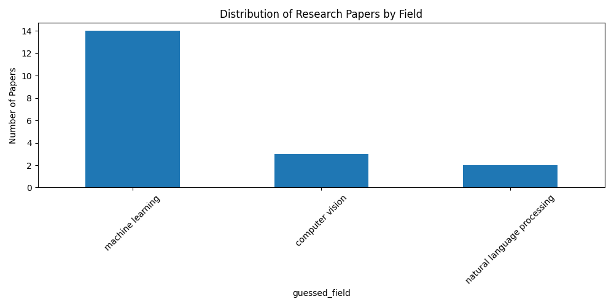

# Arxiv ETL Pipeline — Documentation

## Overview

This project implements an automated ETL (Extract, Transform, Load) pipeline for processing research papers from [arxiv.org](https://arxiv.org/). The pipeline is robust, modular, and easy to maintain. It includes scraping, translation, analytics, and database storage, with optional Airflow automation.

---

## Features

- **Scraping:** Collects paper metadata from arXiv (logic only; no real data required).
- **Translation:** Translates abstracts to Ukrainian using the OpenAI API (or mocks).
- **Analytics:**
  - Calculates word counts.
  - Guesses the research field.
  - Generates reports:
    - Distribution of papers by field.
    - Average word count per category.
- **Database Storage:** Saves processed data in a local PostgreSQL database.
- **Reporting:** Produces visual analytics saved as PNG files.
- **Airflow DAG (Bonus):** Automates and schedules the ETL pipeline.

---

## Project Structure

```
dags/
    arxiv_etl_dag.py   # DAG for automated scraping
etl/
    scraper.py         # Scraping logic for arXiv
    translator.py      # Handles translation (real or mocked)
    processor.py       # Analyzes papers (word count, field detection)
    db.py              # Database models and storage logic
    analytics.py       # Generates analytics and plots
    main.py            # Orchestrates the ETL process
    arxiv_etl_dag.py   # Airflow DAG for automation
airflow.cfg          # Airflow configuration
data/                # Output directory for analytics reports
requirements.txt     # Python dependencies
```

---

## How to Run

1. **Install Dependencies**

   ```bash
   pip install -r requirements.txt
   ```

2. **Set Up the Database**

   Run docker-compose to start PostgreSQL:

   ```bash
   docker-compose up -d
   ```

   Ensure PostgreSQL is running locally. The default credentials (set in `db.py`) are:

   ```
   dbname:   justdone
   user:     postgres
   password: postgres
   host:     localhost
   port:     5432
   ```

3. **Run the ETL Pipeline**

   This will:

   - Scrape (hit cache) papers
   - Translate abstracts (hit cache)
   - Analyze the data & Print output
   - Store data
   - Generate analytics images in the `data/` folder

   ```bash
   python etl/main.py
   ```

4. **(Bonus) Run with Airflow**

   - DAG logic is developed
   - Airflow basic configuration is done thought `airflow-docker-compose`
   - , BUT
     - I didn't finish airflow configuration, so right now DAG cannot access database.
     - Easiest solution would be to put db configuration into `airflow-docker-compose`

---

# Notes

- **No real data is required:**

The code can run in "real mode" hitting website and OpenAI API. But in default configuration it is hitting .cache for both scrapper and translations api.
Sometimes it is not logically right to use cache, I just want it to work for everyone who'd want to try to run this project.

- **Error Handling:**

Basic error handling is there. But it can be improved in various ways (strict model definition - instead of dataclasses, improved error and type handling on scrapping level)

- **Reports:** Analytics plots are saved as PNG files in the `data/` directory.

### Example Reports

- 
- 

---

## Evaluation Criteria

- Technical depth (scraping, API, data processing, error handling)
- Code clarity and structure
- Creativity and innovation (e.g., Airflow automation, scalable architecture, basic caching for test, implemented extensive logging)

---

# TODO

push to github
